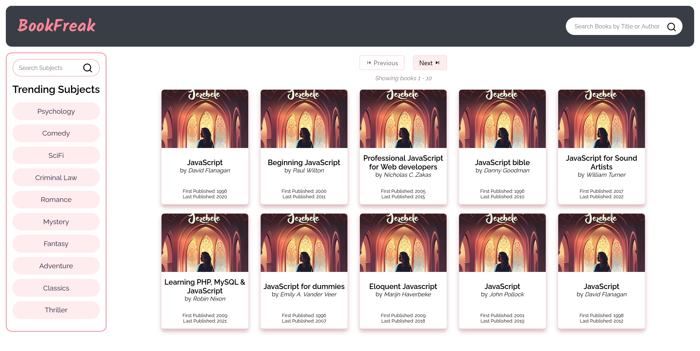
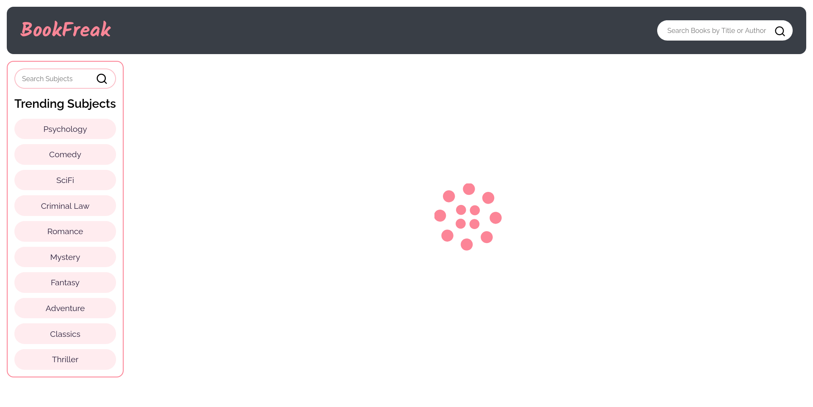
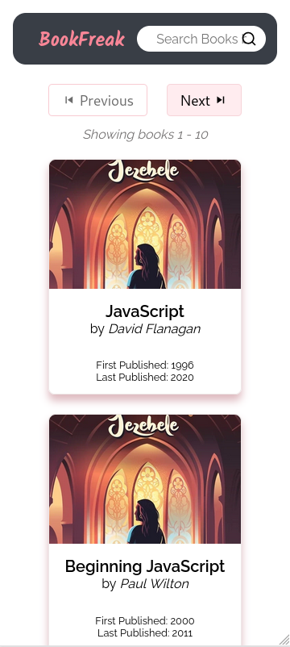

<h1 align="center">Books Library</h1>

   Search for books, using Title, Author or Subject.

## Table of Contents

-   [How to run locally](#how-to-run-locally)
-   [API Description](#api-description)
-   [Features](#features)
-   [Screenshots](#screenshots)
-   [Technologies Used](#technologies-used)
-   [Contact](#contact)

 

## How to run locally

1. Download the repository either as a zip or by cloning it (see [degit](https://github.com/Rich-Harris/degit)).
2. Open the terminal in the downloaded folder and type `yarn` or `npm i`. This will download the needed modules to build and run the website.
3. After the downloading is finished, type `yarn dev --open` or `npm run dev -- --open`.
4. Go to the browser and the website should have been open. If not, then type `localhost:5173` in the URL bar.

## API Description

API used - [Internet Archive's Open Library API](https://openlibrary.org/developers/api).
More specifically [Subjects](https://openlibrary.org/dev/docs/api/subjects) and [Search](https://openlibrary.org/dev/docs/api/search) APIs.
These are free-to-use APIs and doesn't require any key or secret ID.

## Features

-   Search book using Title/Author.
-   Search book using Subjects.
-   A list of trending subjects in the sidebar for easy access.
-   Loader, displayed when books are being fetched.
-   Only 10 books display at once, with navigation buttons to see next 10 or previous 10.
-   Mobile friendly website.
-   SPA so redirects happen in a breeze.
-   Cached data so that API isn't called unnecessarily and save bandwidth.

## Screenshots

Desktop View: 
Loading Screen: 
Mobile View: 

## Technologies Used

-   Vanilla CSS
-   ReactJS

## Contact

-   Twitter [@heikrana](https://twitter.com/heikrana)
-   Linkedin [@heikrana](https://linkedin.com/in/heikrana)
